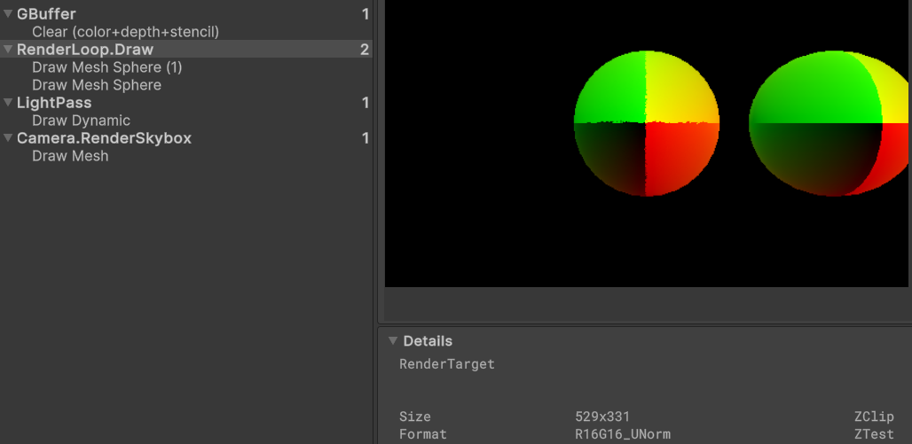
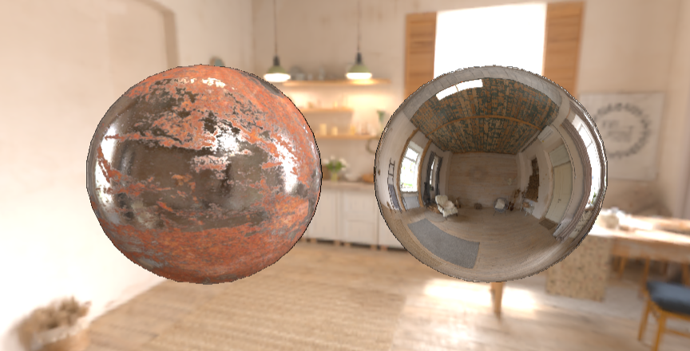

# TSRP

TSRP是基于Unity SRP的延迟渲染管线，个人用于学习和实践实时渲染相关算法的玩具级项目，并且参考了很多前辈的文章和教程。

## Feature

### 延迟渲染管线

GBuffer布局如下，RT0存储了基本颜色和金属度。RT1存储了世界空间法线，其中法线通过八面体压缩将法线的XY转换为32bit的RG通道，以提高法线的精度。RT2存储了自发光颜色和粗糙度。RT3存储了环境光遮蔽，剩余通道暂无用处。

| RT    | R           | G           | B           | A         | Format |
| ----- | ----------- | ----------- | ----------- | --------- | ------ |
| 0     | BaseColor.X | BaseColor.Y | BaseColor.Z | Metallic  | ARGB32 |
| 1     | Normal.X    | Normal.X    | Normal.Y    | Normal.Y  | RG32   |
| 2     | Emission.X  | Emission.Y  | Emission.Z  | Roughness | ARGB32 |
| 3     | AO          | /           | /           | /         | ARGB32 |
| Depth | Depth       | Depth       | Depth       | Depth     | Depth  |

### PBR/IBL

直接光的计算参考Cook-Torrance BRDF实现了金属工作流的PBR光照，简介光的使用了预计算的漫反射、镜面反射辐照度贴图。根据粗糙度决定环境光贴图MipMap的层级，这部分实现参考了Unity源码中的快速计算。镜面反射项以NoV和粗糙度为uv坐标，查询BRDF LUT后得到BRDF的预积分。

