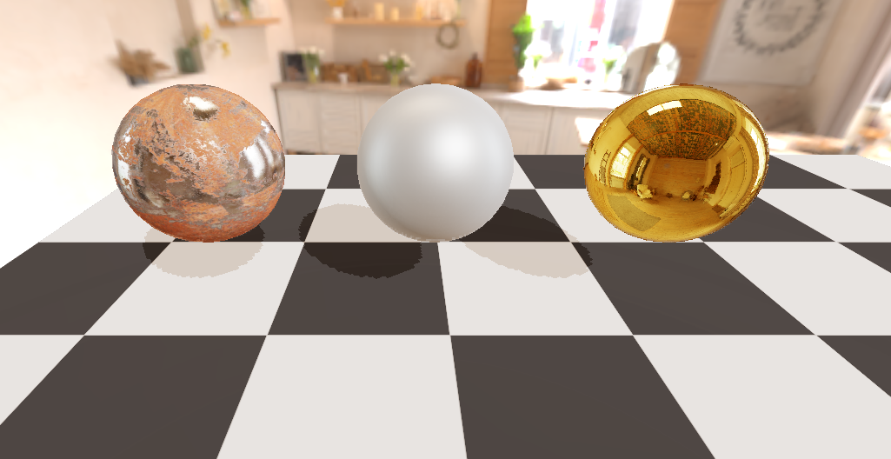
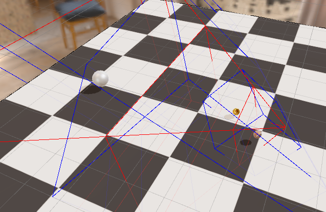
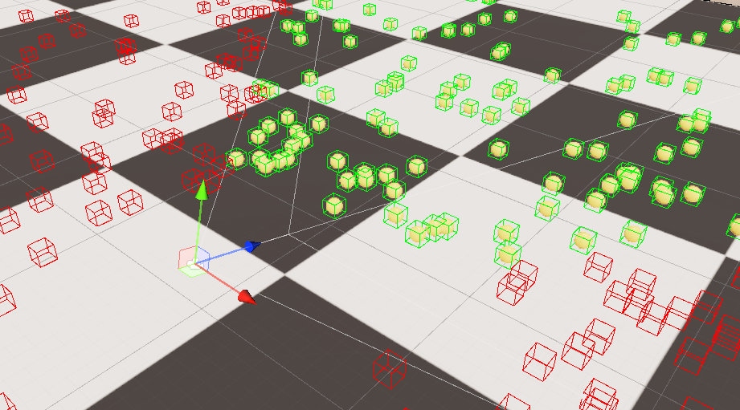

# TRP

TSR is a custom render pipeline based on Unity SRP, which is utilized for personal learning and implementing rendering algorithm.

- Unity 2023.1.0a21 Alpha

## Feature

### Deferred Render Pipeline

| RT    | R           | G           | B           | A         | Format   |
| ----- | ----------- | ----------- | ----------- | --------- | -------- |
| 0     | BaseColor.X | BaseColor.Y | BaseColor.Z | Metallic  | R8G8B8A8 |
| 1     | Normal.X    | Normal.X    | Normal.Y    | Normal.Y  | R16G15   |
| 2     | Emission.X  | Emission.Y  | Emission.Z  | Roughness | R8G8B8A8 |
| 3     | AO          | /           | /           | /         | R8G8B8A8 |
| Depth | Depth       | Depth       | Depth       | Depth     | Depth    |

### PBR & IBL

- Metal/Roughness Workflow

- Cook-Torrance BRDF

### Real-Time Shadow
- Shadow Map

  

- Cascaded Shadow Map

  

### Culling

- Frustum Culling by Compute Shader

  

## Reference

1. [AKGWSB/ToyRenderPipeline: Custom deferred render pipeline with Unity SRP（Scriptable Render Pipeline） (github.com)](https://github.com/AKGWSB/ToyRenderPipeline)
2. [MaxwellGengYF/Unity-MPipeline-Framework: A convenient programming framework for Scriptable Rendering Pipeline (github.com)](https://github.com/MaxwellGengYF/Unity-MPipeline-Framework)
3. [wlgys8/SRPLearn: Unity可编程渲染管线造轮子项目 (github.com)](https://github.com/wlgys8/SRPLearn)

